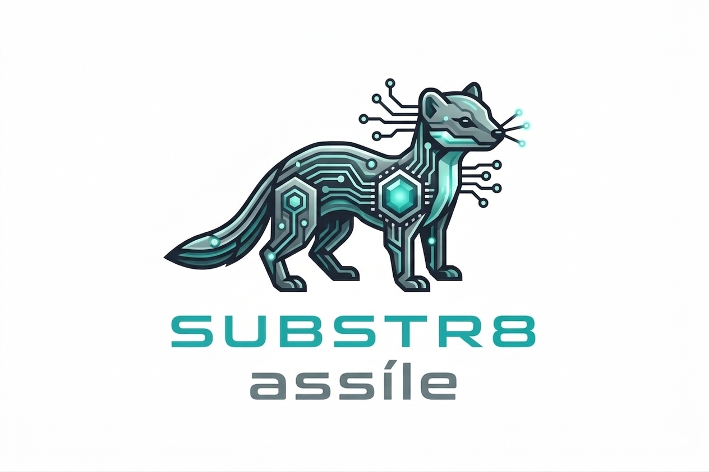

  

_Pala, C. (2026). SUBSTR8 - An open platform for building GIS applications (1.0 Assíle). Zenodo. https://doi.org/10.5281/zenodo.19462380_

SUBSTR8  is a modular platform designed for building standardized spatial analysis software.

It is built on six core modules providing fundamental geospatial functions. Rather than a standalone application, SUBSTR8 is a flexible foundation: you can assemble, extend, and integrate these modules to create custom tools, workflows, or standalone executables.

## 🍸 Philosophy
SUBSTR8 separates core functionality from final implementation. This architecture offers complete freedom to build custom applications, integrate external software, and adapt workflows to specific use cases.

The modules provide the building blocks. The user defines how to use them.

## 🧨 Features
Modular Architecture: Six independent core modules for total flexibility.

-Big Data Optimization: Uses dynamic chunking and multithreading to handle massive rasters without crashing.
-Hardware Agnostic: Specifically engineered to run heavy geospatial workloads on low-end hardware.
-Highly Compatible: Seamlessly integrates with external tools and software.
-Scalable Pipelines: Supports user-defined applications and custom processing pipelines.

## ⚡ Performance

SUBSTR8 is optimized for efficiency, allowing high-speed processing even on older machines.

Benchmark Example:
Hardware: 2018 Lenovo Ideapad 330 15AST (AMD A9, 8 GB RAM)
Performance: 0.0085 ms/pixel

This efficiency ensures that high-end geospatial processing isn't gated behind expensive hardware.

## 🎱 Modules

- launcher: detectes the OS and launches the GUI
- GUI: Guided User Interface based on customtkinter. 
- file_manager: modules handling 100% of raster operations
- assetios.py: module handling I/O dictionaries and system parameters
- mapadore.py: useful to plot simple maps
- about.py: info about bibliography, license, guide and developer

## 🔥 Use cases

- Environmental and geospatial analysis  
- Integration of satellite and remote sensing data  
- Custom GIS tools and workflows  
- Research-oriented software development
- maybe others I don't actually know?

## 🪩 Status

🚧 Active development

## ✨ Dependencies & Licenses

SUBSTR8 depends on the following open source libraries:

- NumPy (BSD License)
- Dask (BSD License)
- Dask-image (BSD License)
- Rasterio (BSD License)
- GeoPandas (BSD License)
- psutil (BSD License)
- SciPy (BSD License)
- Matplotlib (PSF License)
- Pillow (PIL Software License)
- Requests (Apache 2.0)
- Tkinter (Python License)
- customtkinter (MIT License)

All copyright and license notices for these libraries are retained. (my apologies if I did some mistake or forgot somebody.. in such case please let me know!)

Assíle: https://en.wikipedia.org/wiki/European_pine_marten
